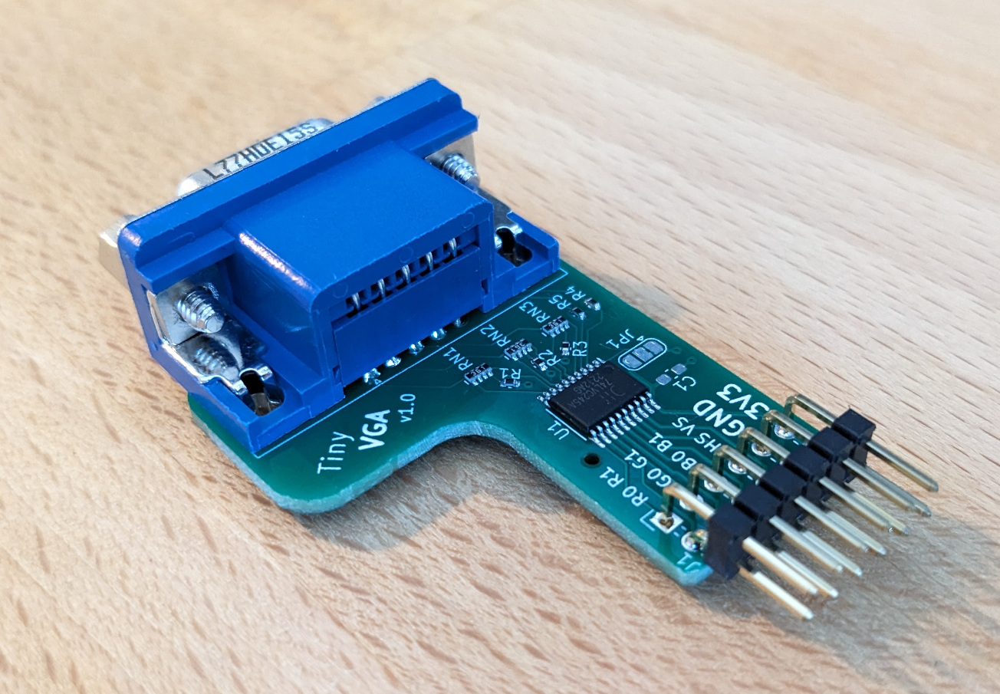
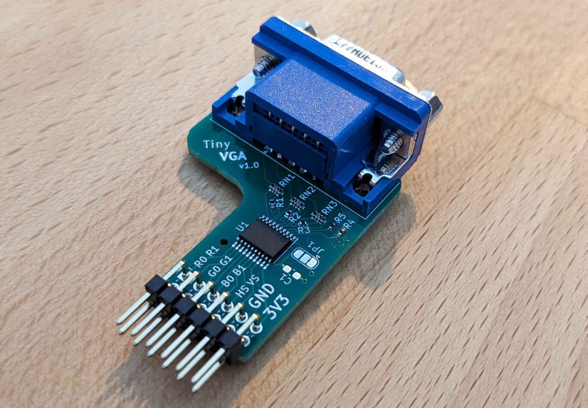
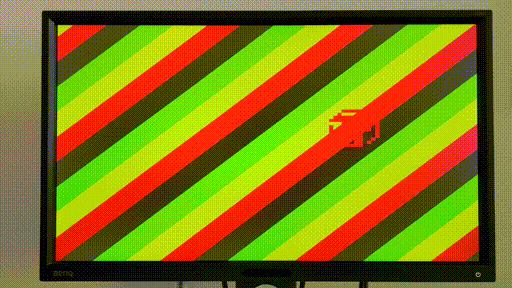

# Tiny VGA

Tiny VGA provides VGA output for up to two bits per color with just one Pmod. The board is designed in KiCad and uses two layers to be easily manufacturable.

For the VGA connector [this one](https://eu.mouser.com/ProductDetail/Amphenol-Commercial-Products/L77HDE15SD1CH4FVGA?qs=ToP8pWlZ0bNtQSp9f8k5Rw%3D%3D) was used.

- JLCPCB

[KiCAD JLCPCB tools](https://github.com/Bouni/kicad-jlcpcb-tools) needs to be installed to create the production files. Or you can use them right away under `pcb/jlcpcb/production_files`.

# Pinout

Pin numbering according to Pmod specification.

top row - bottom row

| Pin | Signal | Pin | Signal |
|-----|--------|-----|--------|
| 1   | R1     | 7   | R0     |
| 2   | G1     | 8   | G0     |
| 3   | B1     | 9   | B0     |
| 4   | VS     | 10  | HS     |
| 5   | GND    | 11  | GND    |
| 6   | VCC    | 12  | VCC    |

> R0, G0, B0 are the least significant bits\
> R1, G1, B1 are the most significant bits\
> VS ... vertical sync\
> HS ... horizontal sync\
> VCC must be 3V3

# Board Images

The board as it arrived from JLCPCB.

|          |      |
|--------------|-----------|
|  |       |

The board after soldering the Pmod connector and the VGA connector.

# Demo

The output is 800x600 SVGA and the quality is excellent in real life.

# License

This work is licensed under a
[Creative Commons Attribution-ShareAlike 4.0 International License][cc-by-sa].

[cc-by-sa]: http://creativecommons.org/licenses/by-sa/4.0/

Copyright (c) Leo Moser