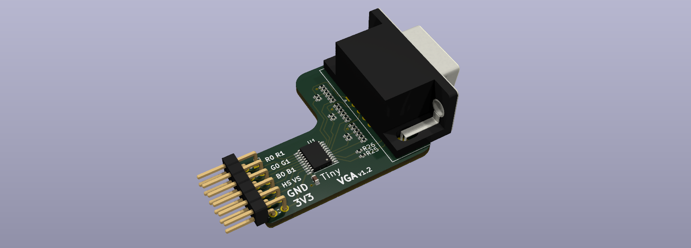
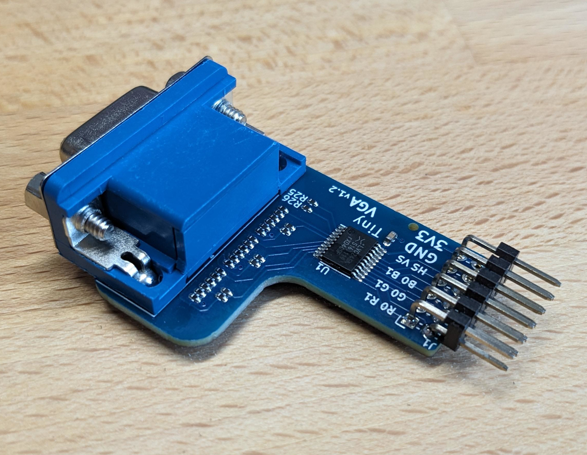
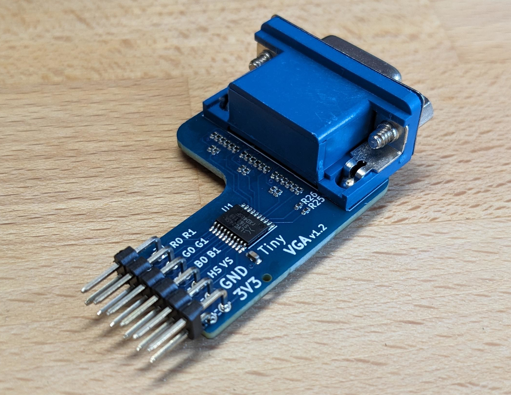

# Tiny VGA 

Tiny VGA is a Pmod peripheral designed for [Tiny Tapeout](https://tinytapeout.com/), but can of course also be used with any other Pmod compatible hardware such as certain FPGA boards.

Viwe the schematic online using [KiCanvas](https://kicanvas.org/?github=https%3A%2F%2Fgithub.com%2Fmole99%2Ftiny-vga%2Fblob%2Fmain%2Fpcb%2Ftiny-vga.kicad_sch)!

**Why Yet Another Pmod VGA Peripheral?**

Tiny VGA only needs one Pmod connector to work. This means if you choose to use the output Pmod of the Tiny Tapeout PCB to connect to Tiny VGA, you still have the bidirectional and input Pmod available for other purposes.

It defines an interface for 2-bit per color VGA, so you can easily try other Tiny Tapeout designs that use the Tiny VGA pinout.

The board is designed in [KiCad](https://www.kicad.org/) and uses the [KiCAD JLCPCB tools](https://github.com/Bouni/kicad-jlcpcb-tools) to manage the assignment of components from the JLCPCB parts library.

## How Do I Get One? 

I do not sell Tiny VGAs, but you can order a few Tiny VGAs directly from PCB manufacturers for relatively little money. the cost per PCB gets cheaper if you order, say, ten at a time. You could give away the remaining Tiny VGAs to others who are located near you to help out the community :)

Search the Tiny Tapeout Discord server for others who could use one.

## Ordering Tiny VGA at JLCPCB

I have designed Tiny VGA so that it can be easily ordered fully-manufactured from JLCPCB. I am not sponsored or affiliated with JLCPCB in any way. If you would like to make it possible to produce Tiny VGA with other PCB manufacturers, you are welcome to contribute!

The [KiCAD JLCPCB tools](https://github.com/Bouni/kicad-jlcpcb-tools) needs to be installed to create the production files. Or you can use them right away under `pcb/jlcpcb/production_files/`.

1. Go to [JLCPCB](https://jlcpcb.com/) and create an account. 
2. Upload the gerber files from `pcb/jlcpcb/production_files/GERBER-tiny-vga.zip`.
3. You will get various options to choose from and a price offer. You don't really need to change anything, but you could change the quantity, choose a different color for the PCB and remove the order number.
3. Next, enable "PCB Assembly", keep the settings as they are and confirm. You will be forwarded to a new page with a view of the PCB. 
4. Click on "Next" and you will be prompted to upload the BOM and CPL file which you can find under `pcb/jlcpcb/production_files/BOM-tiny-vga.csv` and `pcb/jlcpcb/production_files/CPL-tiny-vga.csv`. 
5. The next page shows you all the parts that will be placed. 
6. Again, "Next" will lead you to the component placement page where you can confirm the placement of the parts. Here you might need to rotate some of the components.
7. Click on "Next" and you will get your quote for the assembled PCBs. Proceed to the checkout and you are done :D

## Tiny VGA Pinout

Pin numbering according to Pmod specification.

| Pin | Signal | Pin | Signal |
| :-: | :----: | :-: | :----: |
| top row    | | bottom row | |
| 1   | R1     | 7   | R0     |
| 2   | G1     | 8   | G0     |
| 3   | B1     | 9   | B0     |
| 4   | VS     | 10  | HS     |
| 5   | GND    | 11  | GND    |
| 6   | VCC    | 12  | VCC    |

> [!NOTE]  
> R0, G0, B0 are the least significant bits\
> R1, G1, B1 are the most significant bits\
> VS is the vertical sync\
> HS is the horizontal sync\
> VCC must be 3V3

## Board Images

### v1.0

Tiny VGA v1.0 board manufactured by JLCPCB, including SMD components (THT connectors manually soldered).

|          |      |
|--------------|-----------|
|  |       |

### v1.2

Tiny VGA v1.2 board manufactured by JLCPCB, including SMD components and THT connectors.

|          |      |
|--------------|-----------|
|  |       |

## Demo

The demo output is 800x600 SVGA and the quality is excellent in real life.

## License

This work is licensed under a
[Creative Commons Attribution-ShareAlike 4.0 International License][cc-by-sa].

[cc-by-sa]: http://creativecommons.org/licenses/by-sa/4.0/

Copyright (c) Leo Moser